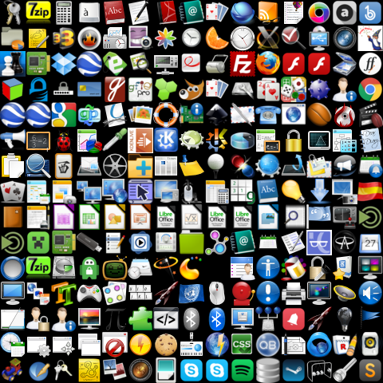
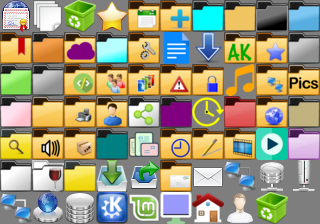

Places

Apps

An icon theme where folders have black tabs and the folders are a bit taller than most I have seen.
I have customized many icons for a more colorful appearance, filled in missing icons that would default to other less colorful themes.

There is a complimentary theme 'AKicons' that has white tabs on the folders.
AKicons is no longer updated as of November 2020.

Download the repository by clicking the Code button and download zip.  Uncompress the download and rename the folder to AKiconsB 
Place AKiconsB folder in the ~/.icons folder for personal use.
Put AKiconsB folder in /usr/share/icons folder for global use.

Recent update to Mint 20.1 now uses the apps/system-file-manager.png icon as system wide folder icon in Nemo and on the panel.   
To compensate for this so that the folder icon is still shown in the panel the way previous versions have shown, I have changed the system-file-manager.png icon. 
A system-file-manager2.png is available if you wish to use a file cabinet as Mint 20.1 intends it to be.  I simply edit the launcher on the panel.
